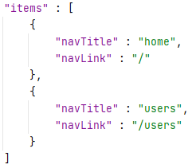
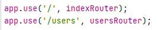
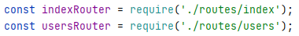

# Handlebars navigation template

### Install
1. install npm (shipped with node. nvm recommended for node install)
1. `npm install`

## Usage
### Serve application
Build & serve web application: `npm run start`

### Add item to the navigation bar
#### Navigation items
Add a new link to the navigation bar just by adding a new item to the navigation.json file (view/partials)

Each item needs two properties:
- navTitle: will be used as name of the navigation item on the web page
- navLink: defines the link ot the navigation item

All defined items will automatically be generated on the navigation bar of the webpage.

#### Routes
For each new link the corresponding route has to be defined in the app.

#### Endpoint
Each route requires an existing endpoint.

